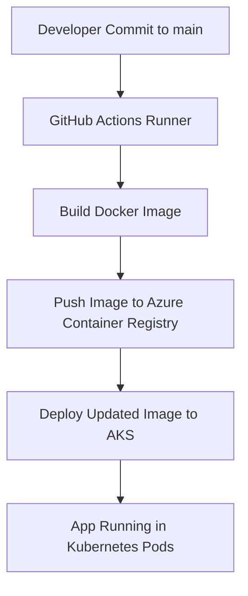

# NYC Energy Demand Forecast ML Pipeline - Airflow (Kubernetes, AKS, AZCR, Docker) - ML & API (Databricks, MLFlow, AKS) - Infastructure As Code (Terraform)

## Command Line Interfaces Used:
 - AZ CLI (Azure)
 - Terraform CLI
 - Kubernetes (kubectl)

## Key Services Used:
 - AKS (Kubernetes Cluster VM Azure)
 - Azure Container Registry (AZCR)
 - Azure Key Vault
 - Databricks
 - Terraform
 - Dash App
 - Airflow
 - Docker
 - Python

# CI/CD Pipeline (GitHub Actions → Azure)

This project uses **GitHub Actions** to automate the build and deployment process.

## Workflow Overview
- **Trigger**: On every push to the `main` branch
- **Steps**:
  1. **Build Docker image** using project `Dockerfile`
  2. **Push image** to Azure Container Registry (ACR)
  3. **Deploy to AKS** by updating Kubernetes deployment with the new image
  4. **Rollout verification** ensures pods are healthy

## Key Components
- **GitHub Actions** workflow defined in [`.github/workflows/ci-cd.yml`](.github/workflows/ci-cd.yml)  
- **Helper scripts**:
  - `scripts/build_docker.sh` → Builds the Docker image
  - `scripts/push_azcr.sh` → Tags & pushes image to ACR
  - `scripts/deploy_aks.sh` → Updates AKS deployment and waits for rollout

## Example Workflow Diagram

# Terraform:

# Airflow

# ML Deployment to AKS

## Dash Web App Demonstration Model Application

